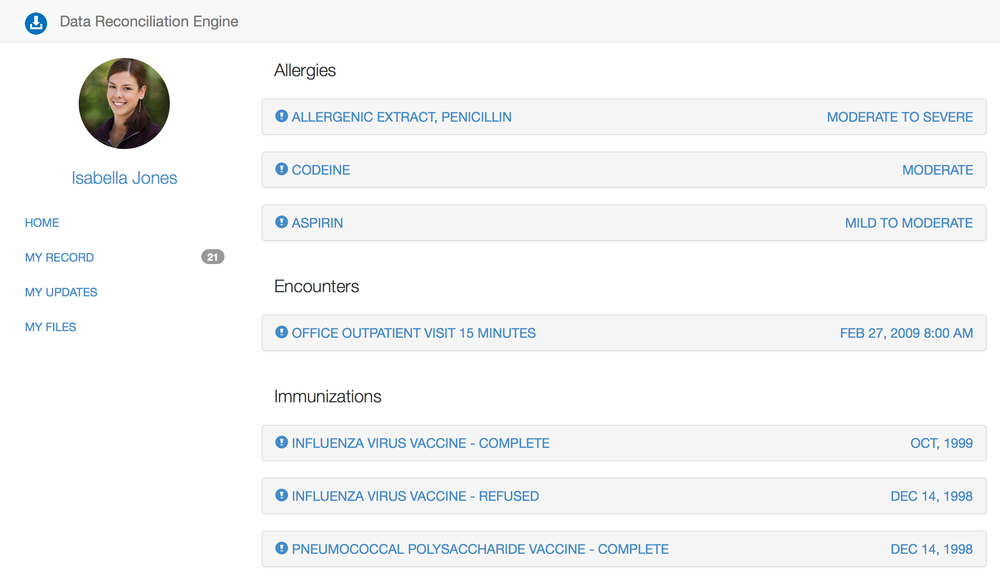
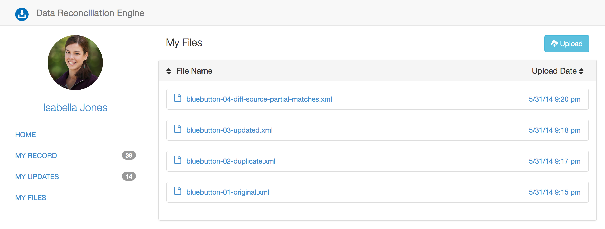
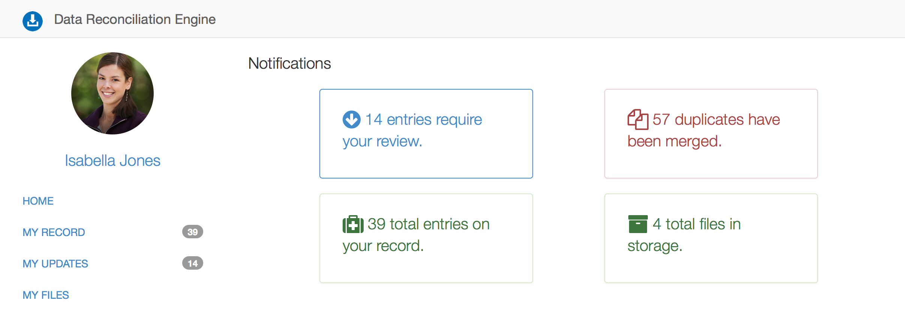
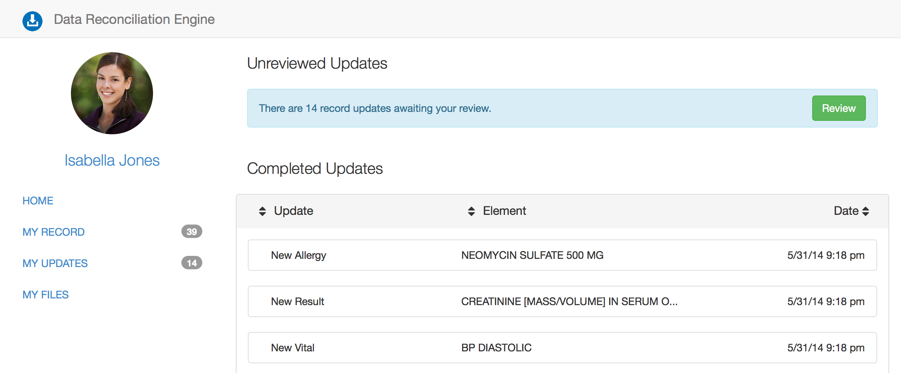
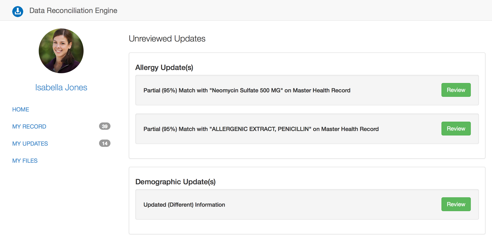
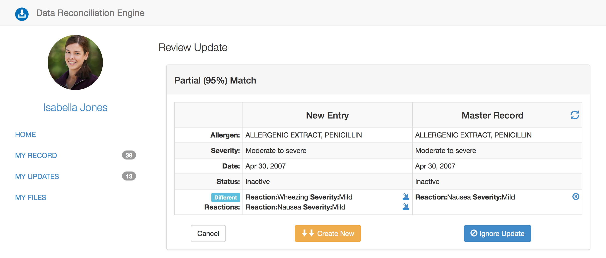

Data Reconciliation Engine (DRE)
=========

DRE is a demo frontend and Node.js server for reconciling health data.

aka. Raccoon - Data Raccoonciliation Engine for Health Data.


[](https://travis-ci.org/amida-tech/DRE)

High Level Overview
===================


The purpose of the Data Raccoonciliation Engine is to take personal health data in a variety of formats (starting with BlueButton/CCDA) from multiple sources and parse/normalize/de-duplicate/merge it into a single Patient's Master Health Record with patient assistance (although most of hard work will be done automagically).


Raccoon's components
=================


Raccoon has 4 primary elements

#### 1 - Parsing and Normalization Library.

This parses incoming data into a homogenous, simplified and normalized data model in JSON format. 

Parsing library code: [amida-tech/blue-button](https://github.com/amida-tech/blue-button)


#### 2 - Matching Library.

This takes the standardized data elements and flags probable duplicate values. New patient records are compared against the existing Master Health Record and automatically matched. The result produces a list of all entries in the new record, labelled as duplicates (0 % match), new entries (100% match), or partial matches (to be reconciled by patient in a next step).

Matching library code: [amida-tech/blue-button-match](https://github.com/amida-tech/blue-button-match)

#### 3 - Reconciliation Interface.

This provides a RESTful API and UI for review and evaluation of duplicate or partially matched entries, by the patient.

#### 4 - Master Record Interface.

This provides a API for interaction with and access to the aggregated health record.

Documentation for record.js [API](./docs/recordjs.md)

Project Roadmap (tentative)
===============

Release 0.5 (end of April, 2014)
----------------

- Uses existing bluebutton.js lib for parsing (with some fixes/improvements)
- Matching library detects duplicate, new entries, and partial matches
- Reconciliation UI supports duplicate and new entry reconciliation
- Master Health Record library supports persistence to MongoDB
- Data model for CCDA JSON representation is defined for a few sections (e.g. Allergies)

Release 1.0 (end of May, 2014)
----------------

- CCDA JSON data model is fully defined as separate library with validation support
- bluebutton.js parser is rewritten for speed and support of updated CCDA JSON data model
- Matching library supports % match for entries that may be possible match
- Reconciliation UI support reconciliation of % matched entries (e.g. partial match)
- Master Health Record library supports persistence and full validation of CCDA JSON into MongoDB

Release 1.1 (September 2014)
----------------

- CMS JSON data model is fully defined 
	- Insurance and claims sections added to support CMS files
- New many-to-many matching library supports multiple partial matches for one entry
- Updated reconciliation UI supports many-to-many matching library
- Master Health Record library supports persistence and full validation of CMS JSON into MongoDB
- Master Health Record can now be exported as a CCDA file


###Screenshots of demo app










##Quick up and running quide

###Prerequisites

- Node.js (v0.10+) and NPM
- Grunt.js
- MongoDB

```
# you need Node.js and Grunt.js installed
# and MongoDB + Redis runnning

#build client app
cd client
npm install
grunt

#run server side tests
cd ..
cd server
npm install
grunt

#run server
node server.js

# go to localhost:3000 in your browser
```


## Contributing

Contributors are welcome. See issues https://github.com/amida-tech/DRE/issues

## Release Notes

See release notes [here] (./RELEASENOTES.md)

## License

Licensed under [Apache 2.0](./LICENSE)